  

  <em>🔥 Transformando café em código de alta performance. Apaixonado por arquitetura limpa, microsserviços e muito open-source.</em> 
  <b>Menos papo, mais código. ⚡</b>

 

## 📊 Tech Stack & Domínios Arquiteturais

<table align="center">
  <tr>
    <td align="center" width="250">
       
      <b>Cloud & DevOps</b> 
       
      Containers, Pipelines, AWS Services
    </td>
    <td align="center" width="250">
       
      <b>Backend & APIs</b> 
       
      Microsserviços, REST, Bancos SQL
    </td>
    <td align="center" width="250">
       
      <b>Frontend & SPA</b> 
       
      Componentização, Estado, SSR
    </td>
  </tr>
</table>

---

## 🚀 Projetos em Destaque & Pipeline Status
*(Esses cards são renderizados dinamicamente pelo GitHub Actions que varre os seus repositórios ativos!)*

<!-- START_REPOS -->

  
  
  

<!-- END_REPOS -->

---

## 🏗️ Arquitetura de Referência (Cloud Native)

Como eu prevejo o ciclo de vida de uma aplicação moderna, do Edge às Bases de Dados:

```mermaid
graph TD
    Client([💻 Web/Mobile Client]) --> CDN[⚡ CloudFront / CDN]
    CDN --> API[🚪 API Gateway]
    
    subgraph Microservices Cluster
        API --> Auth[🔐 Auth Service]
        API --> App1[⚙️ Core Service]
        API --> App2[📊 Analytics Service]
    end
    
    App1 --> DB[(🐘 PostgreSQL)]
    App1 --> Cache[(⚡ Redis)]
    App2 --> EventBus{📨 Message Broker Kafka/RabbitMQ}
    EventBus --> Worker[👷 Background Workers]
```

-----

---

## 👨‍💻 Atividade Recente (Terminal Log)

  

---

## 🐍 Commits History (Snake Game)
Acompanhamento visual diário:

  <picture>
    <source media="(prefers-color-scheme: dark)" srcset="https://raw.githubusercontent.com/allangaiteir00/allangaiteir00/output/github-contribution-grid-snake-dark.svg">
    <source media="(prefers-color-scheme: light)" srcset="https://raw.githubusercontent.com/allangaiteir00/allangaiteir00/output/github-contribution-grid-snake.svg">
    
  </picture>

*(Gerado via [GitHub Actions](https://github.com/allangaiteir00/allangaiteir00/actions))*

---

## 📫 Onde me Encontrar

  
  

